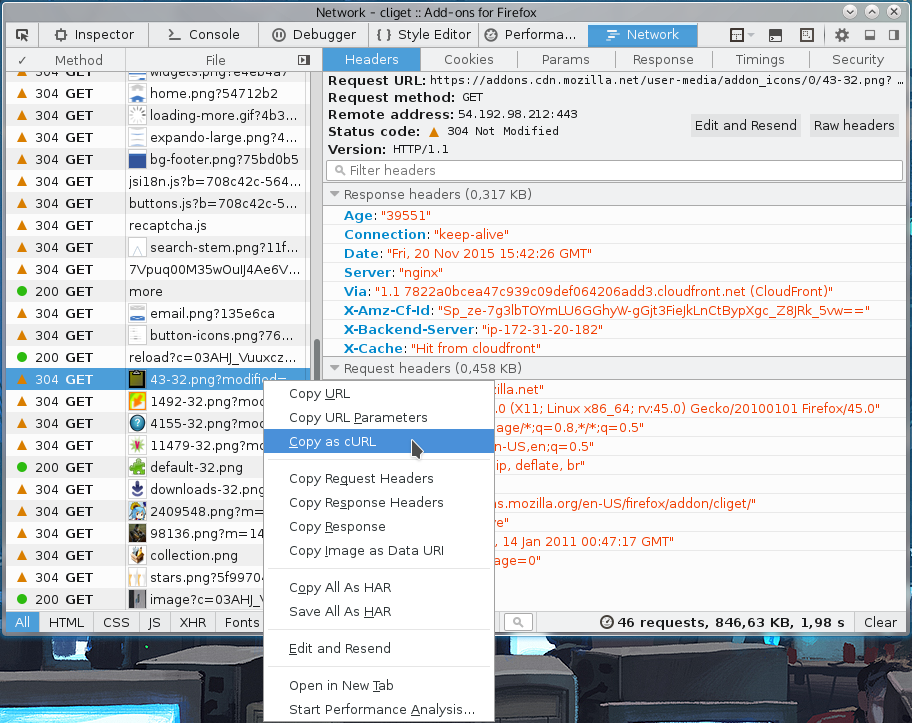

# Copy as curl

Using curl to reproduce an operation a user just managed to do with his or her
browser is a common request and area people ask for help about.

How do you get a curl command line to get a resource, just like the browser
would get it, nice and easy? Chrome, Firefox, Edge and Safari all have this
feature.

## From Firefox

You get the site shown with Firefox's network tools. You then right-click on
the specific request you want to repeat in the "Web Developer->Network" tool
when you see the HTTP traffic, and in the menu that appears you select "Copy
as cURL". Like this screenshot below shows. The operation then generates a
curl command line to your clipboard and you can then paste that into your
favorite shell window. This feature is available by default in all Firefox
installations.

## From Chrome and Edge

When you pop up the More tools->Developer mode in Chrome or Edge, and you
select the Network tab you see the HTTP traffic used to get the resources of
the site. On the line of the specific resource you are interested in, you
right-click with the mouse and you select "Copy as cURL" and it will generate
a command line for you in your clipboard. Paste that in a shell to get a curl
command line that makes the transfer. This feature is available by default in
all Chrome and Chromium installations.

## From Safari

In Safari, the "development" menu is not visible until you go into
**preferences->Advanced** and enable it. But once you have done that, you can
select **Show web inspector** in that development menu and get to see a new
console pop up that is similar to the development tools of Firefox and Chrome.

Select the network tab, reload the web page and then you can right click the
particular resources that you want to fetch with curl, as if you did it with
Safari..

## On Firefox, without using the devtools

If this is something you would like to get done more often, you probably find
using the developer tools a bit inconvenient and cumbersome to pop up just to
get the command line copied. Then
[cliget](https://addons.mozilla.org/en-US/firefox/addon/cliget/) is the
perfect add-on for you as it gives you a new option in the right-click menu,
so you can get a quick command line generated really quickly, like this
example when I right-click an image in Firefox:

## Not perfect

These methods all give you a command line to reproduce their HTTP transfers.
You will also learn they are still often not the perfect solution to your
problems. Why? Well mostly because these tools are written to rerun the
*exact* same request that you copied, while you often want to rerun the same
logic but not sending an exact copy of the same cookies and file contents etc.

These tools will give you command lines with static and fixed cookie contents
to send in the request, because that is the contents of the cookies that were
sent in the browser's requests. You will most likely want to rewrite the
command line to dynamically adapt to whatever the content is in the cookie
that the server told you in a previous response. And so on.

The copy as curl functionality is also often notoriously bad at using `-F` and
instead they provide handcrafted `--data-binary` solutions including the mime
separator strings etc.
